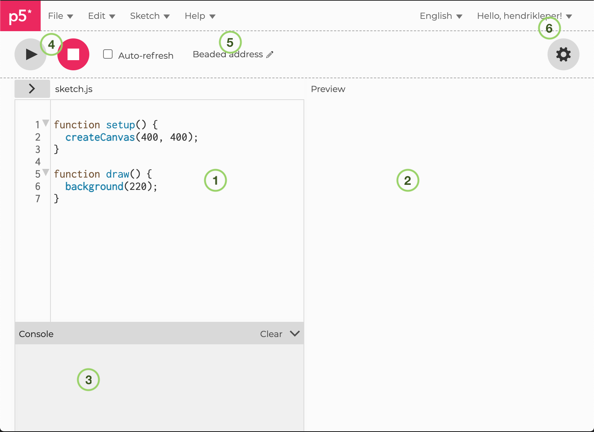
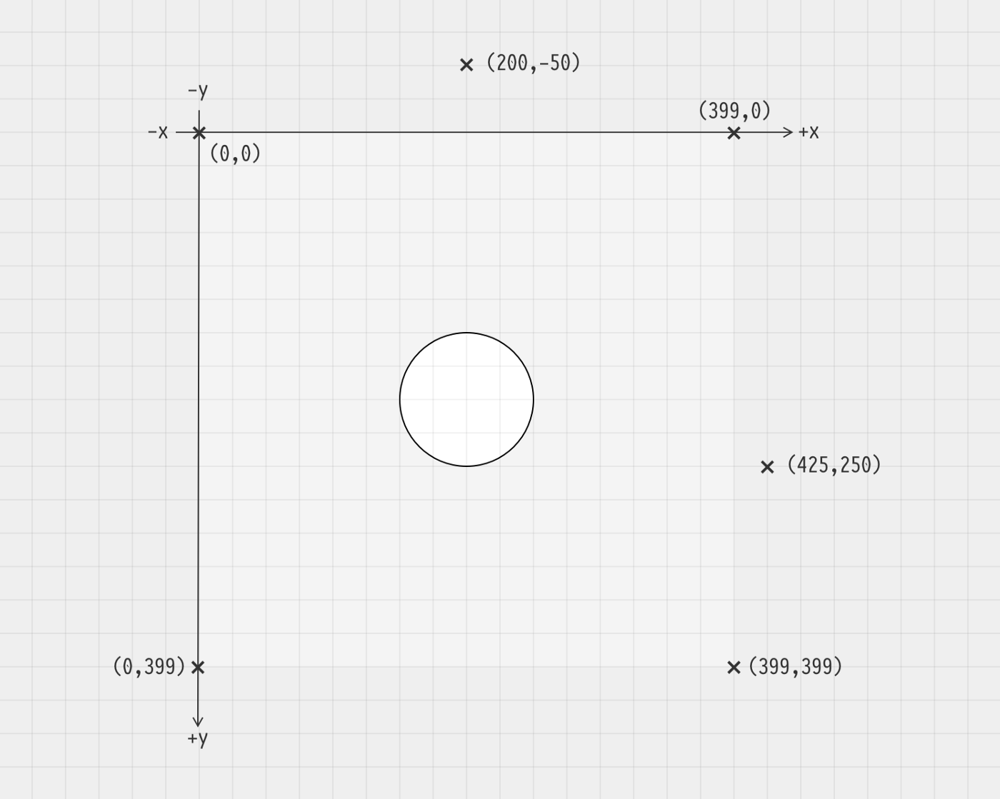
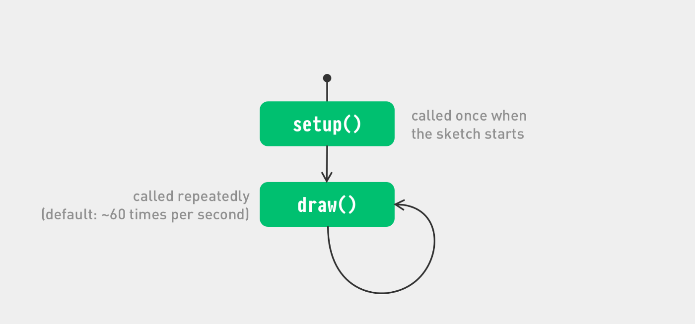
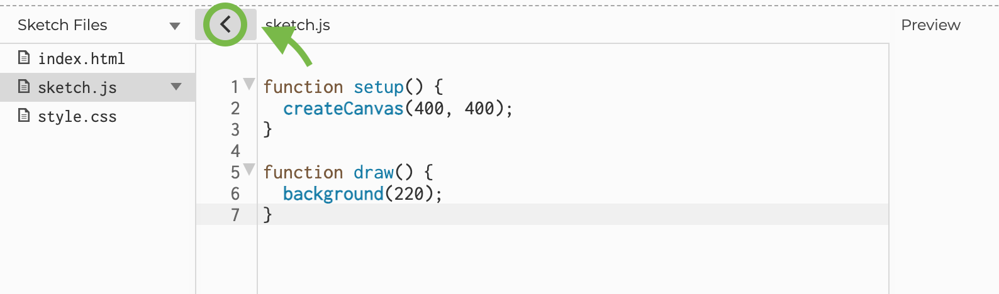

<details>
<summary>Table of Contents - click to expand!</summary>
- [the p5.js web editor](#the-p5js-web-editor)
- [Your first sketch](#your-first-sketch)
- [Coordinates](#coordinates)
- [Change the size of your sketch](#change-the-size-of-your-sketch)
- [Fill and stroke](#fill-and-stroke)
- [Other shapes](#other-shapes)
- [Putting things in motion](#putting-things-in-motion)
- [When something goes wrong](#when-something-goes-wrong)
- [Sharing your work](#sharing-your-work)
- [Download your work](#download-your-work)
- [Move to a desktop Code Editor](#move-to-a-desktop-code-editor)
- [Finding the browser console](#finding-the-browser-console)
</details>

# P5.JS • Quickstart
<sup>*based on [this note](https://creative-coding.decontextualize.com/first-steps/) by Allison Parrish and bits and pieces from here and there.*</sup>

This tutorial will take you through the steps necessary to create your first p5.js sketches.

We will see two methods to write p5.js sketches: with a separate code editor (as [Atom](https://atom.io/)) but we'll start using the [p5.js web editor](https://editor.p5js.org/).

## the p5.js web editor 
This is a web-based programming environment specifically built for p5.js. It should work in nearly any web browser!

When you load the web editor, you can get started right away but only with an account you will be able to save your work and share it with others.     

Here’s what the web editor looks like and an explanation of the important parts.


1. The **code** pane is where you type your code.
2. The **preview** pane is where your sketch will show up.
3. The **console** pane is where error messages from your code show up. You can also use the `console.log()` function to make text appear here while your program is running.
4. Controls. Press the **Play** button (▶︎) to **run** your sketch. Press **Stop** (◼︎) to terminate the sketch.
5. The name of your sketch. When you create a new sketch a random name is generated. Click the little pencil icon to edit it.
6. The Login section with your archive and the settings button (gear icon) to change the look and behaviour of the editor.

## Your first sketch
Okay, the preliminaries are out of the way! 

Write the function `ellipse(199, 199, 60, 60);` between the curly brackets in the `function draw()` block right after `background(220);` 

Press the **Play** button. In the preview pane you should see a white circle (with black outline) appear on a light grey background.

This is how your script should look like.
```JavaScript
function setup() {
  createCanvas(400, 400);
}

function draw() {
  background(220);
  ellipse(199, 199, 60, 60);
}
```
Congratulations! You’ve made a simple computer program.

So what’s going on here? You made a computer program, but what exactly happened?

`ellipse(199, 199, 60, 60);` is an example of **a function call**     
`background(220);` and `createCanvas(400, 400);` are two other functions. We will learn about them in some minutes.

p5.js comes with several dozen built-in **functions** that perform various tasks, like drawing shapes to the screen or calculating values using math. Learning how to program in p5.js is mostly about learning these commands and what they do.     

Functions are always followed by a pair of parentheses with inside them a value or a comma-separated list of values. These values are called the **parameters**.

Every function uses its parameters in a slightly different way, and part of learning a function is learning what its parameters mean.

In the case of ellipse:
- the first parameter is the X coordinate of the center of the ellipse 
- the second parameter is the Y coordinate
- the third parameter is the width of the ellipse
- and the last parameter is the height of the ellipse

**A function call ends with the semicolon (;)**. 

You can put as many function calls as you want in between the line that reads function draw() { and the } that follows it.    

*(We won’t talk about what function draw() means for now, or what the curly braces mean. Just know that you can put more stuff in between those curly braces if you want more stuff to happen.)*

You can find a big list of p5.js functions in [the p5.js reference](https://p5js.org/reference/). *For now, we’re going to focus just on the most simple functions for drawing shapes to the screen. As the course progresses, we’ll learn about other functions that do more interesting things.*

Let’s give our ellipse a friend to play with.     
Add another shape: `rect(199, 199, 60, 60);`

```JavaScript
function setup() {
  createCanvas(400, 400);
}

function draw() {
  background(220);
  ellipse(199, 199, 60, 60);
  rect(199, 199, 60, 60);
}
```

The `rect()` function draws a rectangle to the screen. The parameters to the rectangle function mean:
- parameter 1: the X position of the rectangle’s upper left-hand corner
- parameter 2: the Y position of the rectangle’s upper left-hand corner
- parameter 3: the rectangle’s width
- parameter 4: the rectangle’s height

Notice that the **functions are drawn in the same order as they’re called**. The rectangle gets drawn on top of the ellipse. If you reverse the order of the commands, the ellipse would be drawn on top instead.

tip: rather than hitting play every time you change something in your sketch you can also enable Auto-refresh.

The `background()` function sets the background color for the entire sketch. 

It takes a single parameter, which is a value from 0 to 255. 0 means black, and 255 means white, other values refer to all of the intervening shades of grey. 

If you call the background function with three values, you can set the background to a color of your choice. The three parameters correspond to the Red, Green and Blue values of the given color. More on colors later.
```JavaScript
function setup() {
  createCanvas(400, 400);
}

function draw() {
  background(255, 175, 204);
  ellipse(199, 199, 60, 60);
  rect(199, 199, 60, 60);
}
```
## Coordinates
Those numbers in a call to ellipse or rect specify positions and dimensions. But what are the units? If 50 is some shape’s X position, what’s the unit? 

**Distances in p5.js are measured in pixels.**

Nearly all digital displays are broken up into tiny squares called pixels. Normally, each pixel is itself an actual, tiny, physical device that can display a color. The screen on your device right now likely has hundreds of thousands if not millions of these tiny devices. Each one is exactly the same size, and together they form a grid.

Every p5.js sketch has a size in pixels — the number of pixels wide it is, and the number of pixels tall.



The pixel in the far upper left-hand corner is designated as the pixel at coordinate 0, 0. As you move further left, the X coordinate increases. As you move further down, the Y coordinate increases, so that the coordinate of the middle of the sketch is 199, 199 and the coordinate at the lower right-hand corner is 399, 399. 

For more information and diagrams, see the [p5.js Coordinate System and Shapes tutorial](https://p5js.org/learn/coordinate-system-and-shapes.html).

## Change the size of your sketch
Up until now we haven’t talked about that strange function `setup()` thing up at the top of the sketch’s source code with the function  `createCanvas()` inside it. As you will have guessed this sets the size (in pixels) of your sketch.   

```JavaScript
function setup() {
  createCanvas(600, 400);
}

function draw() {
  background(255, 175, 204);
  fill(255);
  ellipse(199, 199, 60, 60);
  rect(199, 199, 60, 60);
}
```
Ignore `fill();` we’ll discuss it just below.

The first parameter to the `createCanvas()` function specifies the width of the sketch, and the second specifies its height.

Now that our canvas is wider, let’s scale and spread out our shapes a little bit!

```JavaScript
function setup() {
  createCanvas(600, 400);
}

function draw() {
  background(255, 175, 204);
  fill(255);
  ellipse(180, 199, 200, 200);
  rect(320, 99, 200, 200);
}
```

## Fill and stroke
p5.js lets you control not just the shapes that you draw but also two critical aspects of those shapes’ appearance: what color they are, and what color their outline is. 

You can set the color of a shape with the `fill()` function. Just as with `background()` it can take one parameter to set its greyscale color or three values, to set the color using RGB values.


```JavaScript
function setup() {
  createCanvas(600, 400);
}

function draw() {
  background(255, 175, 204);
  fill(162, 210, 255);
  ellipse(180, 199, 200, 200);
  rect(320, 99, 200, 200);
}
```

Notice that the color in the `fill()` command applies to every shape that gets drawn after it’s called. To change the color for subsequent shapes, include a second `fill()` right before you call the function for the shape whose color you want to be different:

```JavaScript
function setup() {
  createCanvas(600, 400);
}

function draw() {
  background(255, 175, 204);
  fill(162, 210, 255);
  ellipse(180, 199, 200, 200);
  fill(205, 180, 219);
  rect(320, 99, 200, 200);
}
```
You can change the color of the outline of the shapes using the `stroke()` command. Again, just with one parameter for greyscale or three for RGB values.

```JavaScript
function setup() {
  createCanvas(600, 400);
}

function draw() {
  background(255, 175, 204);
  stroke(162, 210, 255);
  ellipse(180, 199, 200, 200);
  stroke(205, 180, 219);
  rect(320, 99, 200, 200);
}
```

There’s also a function called `strokeWeight()` which allows you to set the width of the stroke. The width is measured in pixels, and it again applies to every function called after it:

```JavaScript
function setup() {
  createCanvas(600, 400);
}

function draw() {
  background(255, 175, 204);
  strokeWeight(20);
  stroke(162, 210, 255);
  ellipse(180, 199, 200, 200);
  stroke(205, 180, 219);
  rect(320, 99, 200, 200);
}
```
If you don't want to apply a stroke of fill you can specify this with the functions `noStroke()` and `noFill()`.

```JavaScript
function setup() {
  createCanvas(600, 400);
}

function draw() {
  background(255, 175, 204);
  noFill();
  strokeWeight(20);
  stroke(162, 210, 255);
  ellipse(180, 199, 200, 200);
  fill(205, 180, 219);
  noStroke();
  rect(320, 99, 200, 200);
}
```

recap:
- [`fill()`](https://p5js.org/reference/#/p5/fill) sets the color used to fill shapes
- [`noFill()`](https://p5js.org/reference/#/p5/noFill) disables filling
- [`stroke()`](https://p5js.org/reference/#/p5/stroke) sets the color used to draw lines and borders around shapes
- [`noStroke()`](https://p5js.org/reference/#/p5/noStroke) disables drawing the stroke
- [`strokeWeight()`](https://p5js.org/reference/#/p5/strokeWeight) sets the width of the stroke used for lines, points, and the border around shapes (in pixels)

## Other shapes
Here are some other functions that draw shapes. Each of them works a little bit differently from the next, so consult the reference page for information and instructions.

- [`point()`](https://p5js.org/reference/#/p5/point)
- [`line()`](https://p5js.org/reference/#/p5/line)
- [`quad()`](https://p5js.org/reference/#/p5/quad)
- [`triangle()`](https://p5js.org/reference/#/p5/triangle)

## Putting things in motion
Up until now, our sketches have been pretty…static, but we’re about to change that! 
In this section, we’re going to explore how to add animation to our sketches. 

This moment is also the right time to talk about the two two distinct parts, so-called function blocks: `function setup()` and `function draw()` that shape our scripts. A function block is a way of chunking a group of commands together.

The setup() function is called once when the program starts. It’s used to define initial environment properties such as screen size and background color and to load media such as images and fonts as the program starts.

The draw() function continuously executes the lines of code contained inside its block until the program is stopped. 

There can only be one setup() and one draw() function for each program.



Let try this! Copy the following code.
```JavaScript
function setup() {
  createCanvas(400, 400);
  background(0);
}

function draw() {
  fill(255, 0, 255);
  noStroke();
  ellipse(mouseX,mouseY,30,30)
  if (mouseIsPressed) {
    background(0);
  }
}
```
The program creates a canvas and starts drawing pink circles at the position of the mouse. When a mouse button is pressed the canvas is erased and you can start allover.

More information about the mouseX, mouseY and the if-block will follow in the second part of this tutorial. But it is no rocket-science to understand their function in the program. Isn't it?

Notice also that the background function has moved to the setup function. Can you guess what would happen if it is called from within the draw() function?

Additionally you can set the speed with which draw() is called by using the `frameRate()` function. If you give it a number (12, 24, 25, and 30 are typical), it will attempt to maintain that rate, calling draw() regularly. The default frame rate is based on the frame rate of the display (here also called "refresh rate"), which is set to 60 frames per second on most computers.

## When something goes wrong
Programming is nitpicking work, and it’s easy to get the syntax wrong. If something goes wrong, you’ll get an error message. Error message will appear in that little box beneath the source code editing area, called the **console**.

If you can’t find where the problem is, don’t fret! The error message will give you some hints. The number at the beginning of the error tells you the number of the line that p5.js thinks the problem is on. (Sometimes it’ll be off by a line or two, so you’ll have to hunt around.) The message gives you some idea of what the problem is, although the description is filtered through the weird language of programming language parsers.


This error message shows that there’s a problem on line 2: I accidentally spelled it crateCanvas instead of createCanvas, and JavaScript is helpfully informing me that it has no idea what crateCanvas is.

## Sharing your work
You can share your work right from the web editor. In the web editor’s File menu, select Share. You’ll see a dialog box with four different boxes whose contents you can use to share what you’ve made with other people. 

## Download your work
You can also download your sketch (under File menu). It will download in the form of a zipped and named+timestamped folder containing multiple files. In fact a p5.js sketch is made from a few different languages together. HTML as the backbone linking all other elements together in a page, JavaScript (and the p5.js library) for the (mostly) interactive graphics that display on the page. And sometimes CSS for further styling elements in the HTML page.

Have a look at the 3 files *index.html*, *sketch.js* & *style.css* with Atom (or any text / code editor) but leave the library file(s) *p5.js* and *p5.sound.min.js* untouched.    

You will recognise the contents of *sketch.js*. 



You can actually see (and edit) all 3 files (not the libary) in the editor as well by clicking the arrow in the top left of the editor pane, next to sketch.js. A sidebar will appear with the three files listed. You can select all three and thus modify them.  

## Move to a desktop Code Editor
It is time to do some coding in our Code Editor now.

You can restart with an empty sketch by downloading [an example project with complete library](https://p5js.org/download/) from the download section of the p5.js website. This ensures that you get the latest version.

Open the folder in Atom (as Project Folder). Click on the sketch.js file and it will open on the right where you can edit it. 

If you have the Atom community package **p5js-toolbar** installend and enabled you can toggle the toolbar from the menu Packages > p5js-toolbar > Toggle p5js-toolbar. A toolbar with a familiar pink logo, a play button and links will appear on top of your workspace.

Clicking the play button will actually start a local server and open the file in your default browser. If that does not work and you need / want to set up a local server yourself you can find instructions [here](https://github.com/processing/p5.js/wiki/Local-server).   

Write some functions and watch the changes. 

## Finding the browser console
You notice that writing code this way becomes slightly more complex. You depend on the behaviour of your code editor, a package to run a server and a separate browser.  And on top of that, where did our error-spitting console go?

Luckily every browser comes with a built-in JavaScript console. It is an essential piece in debugging our programs. The console is opened differently depending on which browser you are using. Here are links on how to open the console in [Firefox](https://developer.mozilla.org/en-US/docs/Tools/Web_Console/Opening_the_Web_Console), [Chrome](https://developers.google.com/web/tools/chrome-devtools/open), [Edge](https://docs.microsoft.com/en-us/microsoft-edge/devtools-guide/console), and [Safari](https://support.apple.com/en-ca/guide/safari/sfri20948/mac). 

Try it out with the function `print()`!
