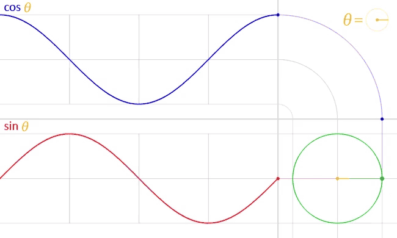
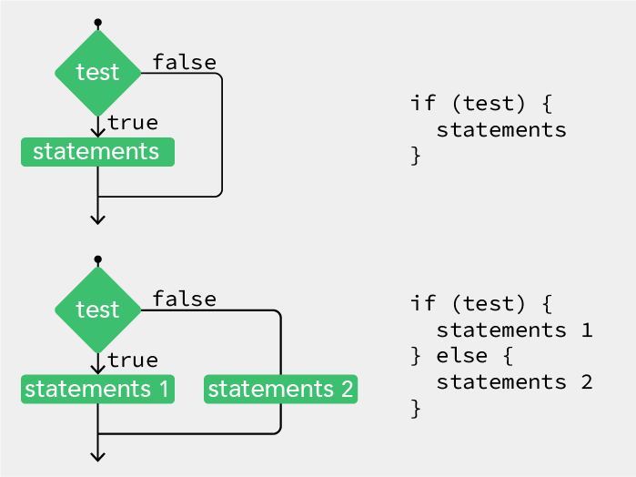
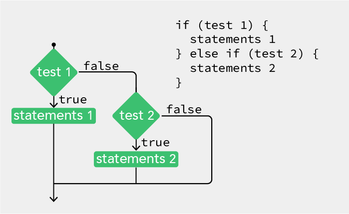
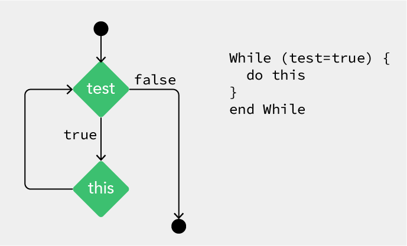
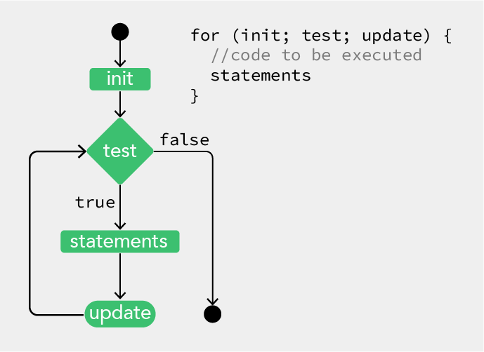

<details>
<summary>Table of Contents - click to expand!</summary>

- [Comments](#comments)
- [Expressions (or math)](#expressions-or-math)
- [Variables](#variables)
- [Random](#random)
- [Linear Motion](#linear-motion)
- [Circular Motion](#circular-motion)
- [Conditionals](#conditionals)
- [While Loop](#while-loop)
- [For Loop](#for-loop)
- [Functions](#functions)
- Bonus: [Recursion](#recursion)
- [Arrays](#arrays)
- [Objects](#objects)

</details>

# P5.JS • Foundation: Expressions, Variables, Conditionals, Loops, Functions, Arrays and Objects.

In the previous tutorial, we went through the basics of working with p5.js. This tutorial goes over a solid number of fundamental concepts of computer programming with expressions (or math), variables, conditionals, loops, functions, arrays and objects. We will apply these concepts in working with random numbers, motion and recursion.     
But we will start with something that is pointless for the machine but, in time, will certainly prove its value to yourself and potential co-coders, *comments*.

## Comments
Comments are parts of the program that are ignored when the program is run. They are useful for making notes for yourself that explain what’s happening in the code. If others are reading your code, comments are especially important to help them understand your thought process. Comments are also useful for trying things in your code without loosing the original attempt.

```JavaScript
// This is a comment on one line
/* This is a comment that
spans several lines
of code */
```

## Expressions (or math)
An expression is a way to make a new value by combining other values with mathematical operators. This is incredibly useful.

#### the p5.js calculator
```JavaScript
console.log(1 + 1);
console.log(0 - 1);
console.log(1 * 0.01);
console.log(1 / 2);
```
`console.log` (or `print`) is a function that prints a message to your browser's web console as seen in previous chapter.

#### a more exciting visual example

```JavaScript
function setup() {
  createCanvas(400, 300);
  stroke(0);
  strokeWeight(3);
  background(255, 175, 204);
  noFill();
  rectMode(CENTER);
  rect(width/2, height*0.5, 200, 200);
  ellipse(width/2, height*0.5, 200, 200);
  triangle(width/2, 50, width-113, 200, 113, 200);
}
```
Note:

- Everything happens in the `setup()` function as we don't need to write this over and over. Just once is fine.
- The 'width' and 'height' variables contain the width and height of the display window as set in the createCanvas() function. If we change the canvas size we don't have to change all the shape drawing functions.
- `rectMode(CENTER)` is far more handy here than the default `rectMode(DEFAULT`. 
- /2 is actually the same *0.5

#### Common Mathematical Operators  are:
| Character | Operator |
| :-: | --- |
| +	| Addition |
| -	| Subtraction |
| *	| Multiplication |
| /	| Division |
| = |	Assignment |


#### Yet there are some rules to remember:
- The order of operations matters, [the PEMDAS rule](https://en.wikipedia.org/wiki/Order_of_operations). 3+2&ast;3 will yield 9. If you want it to result 15 you must write it as (3+2)*3. 
- You can not use **x** as a symbol for multiplication. x is a letter and will be viewed by p5.js as a variable.
- An equals sign works a bit differently than it does in math class. It is used to assign a value to a variable. More on this soon.


## Variables

Now that you have an understanding of values and expressions, we can tackle one of the most powerful concepts in computer programming: **variables**.

A variable stores a value **in memory** so that it can be used later in a program. The variable can be used many times within a single program, and the value is easily changed while the program is running.    

A variable declaration has the following format:
- the keyword let (var is possible too), followed by
- the name of the variable (you get to pick this!), followed by
- an equals sign (=), followed by
- a value you want to “assign” to the variable. 

**The name** is what you decide to call the variable. Choose a name that is informative about what the variable stores, but be consistent, not too criptical nor  too verbose. For instance, the variable name 'radius' will be clearer than 'r' when you look at the code later.

When declaring a variable in processing (that is Java and not Javascript as p5.js) you also need to specify its **data type**, which indicates what kind of information is being stored. The most common data types are: integers (whole numbers), floating-point (decimal) numbers, booleans (true or false), characters, words or strings, and so on. In p5.js you **do not need to do this**. This is actually handy but can also be confusing as you still need to know what kinds of variables there are and how they work. 

To make things even confusing there are two words we can use to set a variable, **"let"** and **"var"**. The difference between them is in their 'scope'. But mostly both will work. Let is newer, and will probably become the standard, so let's use let. If you want to learn about the difference check [this video](https://www.youtube.com/watch?v=q8SHaDQdul0).

Declaring the variable before the setup area means the variable is **'global'** and accessible throughout the entire sketch. If you create a variable inside of setup(), you can’t use it inside of draw() and vice versa. A variable within a function block is only available within that block, thus is **'local'**. It’s good practice to do this if a variable is only needed within a single function. 

#### 9 vertical lines
```JavaScript
let yTop = 20;
let yBottom = 180;

function setup() {
  createCanvas(400, 200);
}

function draw() {
  background(255, 175, 204);
  line(100, yTop, 100, yBottom);
  line(125, yTop, 125, yBottom);
  line(150, yTop, 150, yBottom);
  line(175, yTop, 175, yBottom);
  line(200, yTop, 200, yBottom);
  line(225, yTop, 225, yBottom);
  line(250, yTop, 250, yBottom);
  line(275, yTop, 275, yBottom);
  line(300, yTop, 300, yBottom);
}
```
The real power of variables is that you can use them in any context that you would normally need to write a value. This means that you can use variables in expressions. The example above can be adapted as followed.

#### 9 vertical lines with more variables
```JavaScript
let xPos = 100;
let xStep = 25;
let yTop = 20;
let yBottom = 180;

function setup() {
  createCanvas(400, 200);
}

function draw() {
  background(255, 175, 204);
  line(xPos + (xStep * 0), yTop, xPos + (xStep * 0), yBottom);
  line(xPos + (xStep * 1), yTop, xPos + (xStep * 1), yBottom);
  line(xPos + (xStep * 2), yTop, xPos + (xStep * 2), yBottom);
  line(xPos + (xStep * 3), yTop, xPos + (xStep * 3), yBottom);
  line(xPos + (xStep * 4), yTop, xPos + (xStep * 4), yBottom);
  line(xPos + (xStep * 5), yTop, xPos + (xStep * 5), yBottom);
  line(xPos + (xStep * 6), yTop, xPos + (xStep * 6), yBottom);
  line(xPos + (xStep * 7), yTop, xPos + (xStep * 7), yBottom);
  line(xPos + (xStep * 8), yTop, xPos + (xStep * 8), yBottom);
}
```
There is actually a way to more compactly express this set of instructions with **a loop**. More on that later. First we will add some randomness to our drawing and set our sketch in motion.

## Random
Unlike the smooth, linear motion common to computer graphics, motion in the physical world is usually idiosyncratic. We can simulate the unpredictable qualities of the world by generating random numbers. The [`random()`](https://p5js.org/reference/#/p5/random) function calculates these values and we can set a range to tune the amount of disarray in a program.    

The following short example prints random values to the console, with the range limited by the x position (on the horizontal axis) of the mouse. The `random()` function always returns a floating-point value.

```JavaScript
function draw() {
  let r = random(0, mouseX);
  console.log(r);
}
```

#### Random Dots
```JavaScript
let x, y;  // create two variables x, y for position

function setup() {
  createCanvas(400, 400);
  background(0);
  noStroke();
}

function draw() {
  fill(255, 120, 0, 250);
  x = random(0, width);
  y = random(0, height);
  ellipse(x, y, 15, 15);
  filter(BLUR, 1);
}
```
note:

- `let x, y;` is a shorthand notation for     
`let x;     
let y;` 
- The filter BLUR executes a Gaussian blur, the parameter 1 specifies the intensity of the filter. You might have seen the framerate drop to 5 frames/sec or so. This is a CPU intensive operation. Try `background(0, 5);` at the top of the draw loop instead. 

#### back to our 9 lines in the wind
```JavaScript
let xPos = 100;
let xStep = 25;
let yTop = 20;
let yBottom = 180;
let wind = 5;

function setup() {
  createCanvas(400, 200);
}

function draw() {
  background(255, 175, 204);
  line(xPos + (xStep * 0)+random(-wind,wind), yTop, xPos + (xStep * 0), yBottom);
  line(xPos + (xStep * 1)+random(-wind,wind), yTop, xPos + (xStep * 1), yBottom);
  line(xPos + (xStep * 2)+random(-wind,wind), yTop, xPos + (xStep * 2), yBottom);
  line(xPos + (xStep * 3)+random(-wind,wind), yTop, xPos + (xStep * 3), yBottom);
  line(xPos + (xStep * 4)+random(-wind,wind), yTop, xPos + (xStep * 4), yBottom);
  line(xPos + (xStep * 5)+random(-wind,wind), yTop, xPos + (xStep * 5), yBottom);
  line(xPos + (xStep * 6)+random(-wind,wind), yTop, xPos + (xStep * 6), yBottom);
  line(xPos + (xStep * 7)+random(-wind,wind), yTop, xPos + (xStep * 7), yBottom);
  line(xPos + (xStep * 8)+random(-wind,wind), yTop, xPos + (xStep * 8), yBottom);
}
```
Adding the line `wind = mouseX/20;` in our draw loop will make the random range restricted from 0 to 20 (400/20) depending on the x position of the mouse.

Note: There is actually a nicer, less machine-like, random function, [`noise()`](https://p5js.org/reference/#/p5/noise) form Perlin noise. It produces a more naturally ordered, harmonic succession of numbers. It was invented by Ken Perlin in the 1980s and been used since in graphical applications to produce procedural textures, natural motion, shapes, terrains etc. See also https://genekogan.com/code/p5js-perlin-noise/


## Linear Motion
We have seen that code inside the `draw()` function is called on every program cycle repeatedly and we can set the speed with the `frameRate()` function. 

Well, another power of using variables is we can change them on every cycle. 

#### our line on the move
```javaScript
let xPos = 100;
let xStep = 5;
let yTop = 20;
let yBottom = 180;

function setup() {
  createCanvas(400, 200);
  frameRate(10);
}

function draw() {
  background(255, 175, 204);
  line(xPos, yTop, xPos, yBottom);
  xPos += xStep;
}
```

When you run this you’ll see the line move from left to right. It's position on the x axis is kept in a variable as well as the step (or step size) by which it moves. The draw loop draws the line, and increases the x position by 5. 

Try to change xStep variable smaller if you want to slow the movement down. You can also make it a floating point number, eg. 0.05 

It would be good if we could prevent the line from moving into infinity. Wouldn't it? With conditionals in the next chapter we can.

Note:

- `xPos += xStep;` is actually a shorthand notation of `xPos = xPos + xStep;`
- Even so is writing `a++` equivalent to `a = a + 1` and writing `a--`  equivalent to `a = a - 1`.

## Circular Motion
Circular motion is a movement in which an object travels along the circumference of a circle. However, this simple movement has much more beauty in it than it might seem. We will only lift a tip of the veil of a very fascinating domain including [Simple Harmonic Motion](https://en.wikipedia.org/wiki/Simple_harmonic_motion). Think about the swing of a pendulum, a weight that swings up and down on a spring.

Working with circular motion requires [a little bit of trigonometry knowledge](https://processing.org/tutorials/trig/) but we will limit this to the sine / [`sin()`](https://p5js.org/reference/#/p5/sin) and cosine / [`cos()`](https://p5js.org/reference/#/p5/cos) functions and their relationship. 

Sine and Cosine? Basically, if you were to move around the perimeter of a circle, your horizontal position would trace out a cosine function while your vertical position would trace out a sine. 



#### How do angles work in p5.js 
Angles are set in radians rather than degrees. Radians are angle measurements based on the value of pi (3.14159).

A full circle is 360 DEGREES, which is equal to TWO_PI (2π) in RADIANS.
furthermore 45° = QUARTER_PI, 90° = HALF_PI and 180° = PI
See [this chart on the conversion between degrees and radians](https://en.wikipedia.org/wiki/Radian#/media/File:Degree-Radian_Conversion.svg)

If you prefer to use degree measurements, you ca convert to radians using the [`radians()`](https://p5js.org/reference/#/p5/radians) function or use the [`angleMode(DEGREES)`](https://p5js.org/reference/#/p5/angleMode) function.

#### Sine and Cosine

Using sin(angle) * radius, we can calculate the x coordinate of a point on the circumference of a circle.
Using cos(angle) * radius, we can calculate the y coordinate of the same point.

As a result, sine and cosine are two numbers that oscillate between 1 and -1 according to angle change.

```javaScript
let radius;
let angle = 0;
let speed = 0.05;
let xOffset, yOffset;

function setup() {
  createCanvas(400, 300);
  radius = width / 4;
  xOffset = (width/2);
  yOffset = (height/2);
}

function draw() {
  background(255, 175, 204);
  // Empty Circle as path
  noFill();
  stroke(100);
  circle(0+xOffset, 0+yOffset, radius * 2);
  // Rotating Circle
  noStroke();
  fill(255,0,0);
  let x = cos(angle) * radius;
  let y = sin(angle) * radius;
  circle(x+xOffset, y+yOffset, 20);
  // Increase angle every frame
  angle += speed;
}
```
Note: 

- To make our circle travel around the centre of the canvas, we need to work with those xOffset and yOffset variables. The [`translate()`](https://p5js.org/reference/#/p5/translate) function, that we will see later, simplifies this process considerably.
- add the code below just before the `angle += speed;` line to see the sine and cosine in action in a simple harmonic motion.

```javaScript
circle(xOffset-50, yOffset, cos(angle)*100)
circle(xOffset+50, yOffset, sin(angle)*100)
```

Challenge: modify the code to create a spiralling motion.


## Conditionals

Conditions are like questions. They allow a program to decide to take one action if the answer to a question is **"true"** or to do another action if the answer to the question is **"false"**.

Thus, it checks that a condition has been met before executing the code inside the block marked by the braces that follow it. 

In the case below, the conditional asks whether the value of diam is less than or equal to 400. If it is, the code in the block executes. If not, the code in the block is skipped:

```javaScript
// check a condition
if (diam <= 400) {
	// execute code between the braces
	// if condition is met
}
```
You can also use an else clause to provide a block of code to be executed if the condition isn’t met:

```javaScript
if (diam <= 400) {
	// execute this code if diam <= 400
} else {
	// execute this code if diam > 400
}
```
    
<sub>Flow diagram of conditional test</sub>

If you imagine the flow of execution as a trickle of water running down the script, by setting a conditional you’re effectively creating different channels for the stream to follow.

With an **if ... else** clause, the stream can go one of two ways, either through the block or around. 

The most common relational operators are:    
| Character | Operator |
| :-: | --- |
|>| Greater than |
|<|Less than |
|>=| Greater than or equal to |
|<=| Less than or equal to |
|==| Equal to |
|!=| Not equal to |

In addition you can also use **logic operators** to group conditions: 
| Character | Operator |
| :-: | --- |
|&vert;&vert;| logical OR  |
|&&| logical AND   |
|!| logical NOT|

#### our line on the move in a bounded loop
```javaScript
let xPos = 100;
let xStep = 5;
let yTop = 20;
let yBottom = 180;

function setup() {
  createCanvas(400, 200);
  frameRate(10);
}

function draw() {
  background(255, 175, 204);
  line(xPos, yTop, xPos, yBottom);
  if (xPos > width - 10) {
    xPos = 10;
  } else {
    xPos += xStep;
  }
}
```

Note:
- As is usually the case, you can do things in more than one way. The following was equally good.
```javaScript  
function draw() {
  background(255, 175, 204);
  line(xPos, yTop, xPos, yBottom);
  xPos += xStep;
  if (xPos > width - 10) {
    xPos = 10;
  } 
}
```
Thus the else part is not always necessary and can be omitted.


But we don’t live in an either-or world and so sometimes just having an if and an else isn’t enough.    
Then **else if** comes to the rescue.




#### Lets try a more advanced conditional with 2 tests

```JavaScript
let dice;
let border = 10;

function setup() {
  createCanvas(300, 300);
  background(255, 175, 204);
  stroke(0);
  noFill();
  rectMode(CENTER);
  dice = random(1);
  if (dice < 0.333) {
    ellipse(width / 2, height * 0.5, 200, 200);
  } else if ((dice > 0.333) && (dice < 0.666)) {
    rect(width / 2, height / 2, 200, 200);
  } else {
    triangle(width / 2, 50, width - 50, 250, 50, 250);
  }
}
```
Note:

- the **else-if** statement combines 2 relational expressions with **&&**    
So, if the result of the function random given to the variable dice is greater than 0.333 **and** less than 0.666 then draw a rectangle

- Recap. Any **if** statement can have any number of associated **else if** clauses. Even if you have an **else if** clause, you don’t necessarily need to have an **else** clause.


#### a Bouncing Ball    
And to finish this chapter on conditionals a somewhat classic example

Draw an ellipse that moves from left to right. When it reaches the right hand side of the sketch, make it move from right to left. When it reaches the left hand side again, make it move from left to right again.

```javaScript
let xspeed = 4;
let xpos;
let diam = 30;

function setup() {
  createCanvas(400, 400);
  xpos = diam;
}

function draw() {
  background(255, 175, 204);
  fill(50, 128);
  ellipse(xpos, 200, diam, diam);
  if ((xpos > width - diam / 2) || (xpos < diam / 2)) {
    xspeed = xspeed * -1;
  }
  xpos += xspeed;
}
```


## While Loop 

As you write more programs, you’ll notice that patterns occur when lines of code are repeated, but with slight variations. A code structure called **a loop** (or iteration loop) makes it possible to run a line of code more than once to condense this type of repetition into fewer lines. This makes your programs more modular and easier to change.

```javaScript
let number = 99;
function draw() {
  while (number > 0) {
    console.log(number);
    number--;
  }
  console.log("zero");
}
```
This outputs the value of the variable *'number'* to the console window 99 times. The while command checks a condition and, if the condition is met, executes the code inside the braces; it then loops back up to the top of the block. The execution continues to the final line only after the condition is no longer met (in this case, when 'number' is 0).

Note that if you don’t include the 'number--' line inside the loop, which subtracts 1 from the number every time it loops, the condition will never be met and the loop will go on forever.

    
<sub>Flow diagram of a while loop</sub>


#### Lets draw a line repeatedly as we did before.
```javaScript
let xPos = 100;
let xStep = 25;
let yTop = 20;
let yBottom = 180;

function setup() {
  createCanvas(400, 200);
  frameRate(10);
  background(255, 175, 204);
}

function draw() {
  while (xPos < width - 80) {
    line(xPos, yTop, xPos, yBottom);
    xPos += xStep;
  }
}
```

And now try out adding the wind factor by displacing the top x coordinate!!

```javaScript
let xPos = 100;
let xStep = 25;
let yTop = 20;
let yBottom = 180;
let wind = 5;

function setup() {
  createCanvas(400, 200);
  background(255, 175, 204);
}

function draw() {
  background(255, 175, 204);
  while (xPos < width - 80) {
    line(xPos + random(-wind, wind), yTop, xPos, yBottom);
    xPos += xStep;
  }
  xPos = 80;
}
```
Note: 
- That background() needs to move from the setup function to draw to see only the last movement.  
- you need to reset the variable xPos to is base value at the end.


## For Loop

The for loop is used when you want to iterate through a set number of steps, rather than just wait for a condition to be satisfied. The syntax and flow diagram is as follows:

    
<sub>Flow diagram of a for loop</sub>

The code between the curly brackets { } is called **a block**. This is the code that will be repeated on each iteration of the loop. Inside the parentheses are **three statements**, separated by semicolons, that work together to control how many times the code inside is run. From left to right, these statements are referred to as **the initialization** (init), **the test**, and **the update**. The ‘init’ typically declares a new variable to use within the for loop and assigns a value. The variable name ‘i’ is frequently used. The ‘test’ evaluates the value of this variable, and the ‘update’ changes it’s value.

The test statement is always **a relational expression** that compares two values with a **relational operator**. As mentioned already the common relational operators are:   
`>` Greater than, `<` Less than, `>=` Greater than or equal to, `<=` Less than or equal to, `==` Equal to, `!=` Not equal to    
The relational expression always evaluates to **true** or **false**. When it’s true, the code inside the block is run, when it’s false, the code inside the block is not run and the for loop ends.

```JavaScript
let origx = 100;
let origy = 200;
let destx = 500;
let desty = 200;

function setup() {
  createCanvas(600, 400);
  noLoop();
}

function draw() {
  background(255, 175, 204);
  fill(255);
  strokeWeight(1);
  for (let i = 25; i < 400; i += 25) {
    stroke(50);
    line(width / 2, i, origx, origy);
    stroke(240);
    line(width / 2, i, destx, desty);
  }
}
```

The initial state of the for loop sets a variable i to 25. The code in the loop executes until i <  400 (the height) (the end condition). Every time the loop is executed, the value of i increases by 25, according to the step you’ve defined (i += 25). This means the code inside the parentheses of the for loop will execute 15 times ((400-25/25), with i set to 25, 50, 75 ... 375. Knowing that the i variable follows this pattern, you can use it in multiple ways. 


### Nested for loops
When one for loop is embedded inside another, the number of repetitions is multiplied. The example below does this to draw a grid of points.

```javaScript
let count = 0;

function setup() {
  createCanvas(600, 400);
  stroke(50);
}

function draw() {
  background(255, 175, 204);
  fill(255);
  strokeWeight(1);
  for (let i = 25; i < 600; i += 25) {
    for (let j = 25; j < 400; j += 25) {      
      point(i, j);
      text(count, i, j);
      count ++;
    }
  }
}
```
Notice that we draw in columns. So first the most internal for loop iterates and draws a vertical line of points on the far left, then we move one step to the right with the outer for loop, draw the next column of points and so on. 

A next similar example with dynamic lines reacting on the mouse position. 

```JavaScript
let origx = 200;
let origy = 200;
let destx = 400;
let desty = 200;

function setup() {
  createCanvas(600, 400);
  //noLoop();
}

function draw() {
  background(255, 175, 204);
  fill(255);
  strokeWeight(1);
  origx = mouseX;
  origy = mouseY;
  destx = width - mouseX;
  desty = height - mouseY;
  for (let i = 25; i < 600; i += 25) {
    for (let j = 25; j < 400; j += 25) {
      stroke(50);
      line(i, j, origx, origy);
      stroke(240);
      line(i, j, destx, desty);
    }
  }
}
```
### GOTO 10
"goto 10" refers to "10 PRINT CHR$(205.5+RND(1)); : GOTO 10"      
a random maze generation program in one line of Commodore 64 Basic.
Check [this book](the phenomenon of creative computing and the way computer programs exist in culture.) on the origin of the computer code and the phenomenon of creative computing and the way computer programs exist in culture. 

```JavaScript
// GOTO 10 or Random Diagonal Lines in a grid
let dice = 0;
let tile = 20;

function setup() {
  createCanvas(600, 600);
  background(255);
  stroke(0);
  noLoop();
}

function draw() {
  for (let x = tile / 2; x <= width; x += tile) {
    for (let y = tile / 2; y <= height; y += tile) {
      dice = random(1);
      if (dice <= 0.5) {
        line(x - tile / 2, y - tile / 2, x + tile / 2, y + tile / 2);
      } else {
        line(x - tile / 2, y + tile / 2, x + tile / 2, y - tile / 2);
      }
    }
  }
}
```
```javaScript
// GOTO 10 the Horizontal / Vertical approach
let dice = 0;
let tile = 20;

function setup() {
  createCanvas(600, 600);
  background(255);
  stroke(0);
  noLoop();
}

function draw() {
  for (let x = tile / 2; x <= width; x += tile) {
    for (let y = tile / 2; y <= height; y += tile) {
      dice = random(1);
      if (dice <= 0.5) {
        line(x, y - tile / 2, x, y + tile / 2);
      } else {
        line(x - tile / 2, y, x + tile / 2, y);
      }
    }
  }
}
```
```JavaScript
// Draw Random Shapes in a 10 by 10 grid
let dice = 0;
let tile = 30;
let gutter = 3;

function setup() {
  createCanvas(300, 300);
  background(255);
  stroke(0);
  fill(0);
  rectMode(CENTER);
  noLoop();
}

function draw() {
  for (let x = tile / 2; x <= width; x += tile) {
    for (let y = tile / 2; y <= height; y += tile) {
      dice = random(1);
      if (dice <= 0.5) {
        ellipse(x, y, tile - gutter, tile - gutter);
      } else {
        rect(x, y, tile - gutter, tile - gutter);
      }
    }
  }
}
```
```JavaScript
// Draw a Full Grid of Random Shape 
// Triangles can be orientated in 4 directions
let dice = 0;
let dice2 = 0;
let tile = 100;
let border = tile / 10;

function setup() {
  createCanvas(300, 300);
  background(255);
  fill(0);
  noStroke();
  rectMode(CENTER);
  noLoop();
}

function draw() {
  for (let x = tile / 2; x <= width; x += tile) {
    for (let y = tile / 2; y <= height; y += tile) {
      dice = random(1);
      dice2 = random(1);
      if (dice <= 0.333) {
        // circle
        console.log("circle");
        ellipse(x, y, tile - border, tile - border);
      } else if ((dice > 0.333) && (dice < 0.666)) {
        // rect
        console.log("square");
        rect(x, y, tile - border, tile - border);
      } else {
        if (dice2 <= 0.25) {
          // triangle 1
          console.log("triangle 1");
          triangle(x - tile / 2 + border / 2, y - tile / 2 + border / 2, x + tile / 2 - border / 2, y + tile / 2 - border / 2, x - tile / 2 + border / 2, y + tile / 2 - border / 2);
        } else if ((dice2 > 0.25) && (dice2 <= 0.5)) {
          // triangle 2
          console.log("triangle 2");
          triangle(x - tile / 2 + border / 2, y - tile / 2 + border / 2, x + tile / 2 - border / 2, y - tile / 2 + border / 2, x + tile / 2 - border / 2, y + tile / 2 - border / 2);
        } else if ((dice2 > 0.5) && (dice2 <= 0.75)) {
          // triangle 3
          console.log("triangle 3");
          triangle(x - tile / 2 + border / 2, y - tile / 2 + border / 2, x + tile / 2 - border / 2, y - tile / 2 + border / 2, x - tile / 2 + border / 2, y + tile / 2 - border / 2);
        } else {
          // triangle 4
          console.log("triangle 4");
          triangle(x + tile / 2 - border / 2, y - tile / 2 + border / 2, x + tile / 2 - border / 2, y + tile / 2 - border / 2, x - tile / 2 + border / 2, y + tile / 2 - border / 2);
        }
      }
    }
  }
}
```

### with color
```JavaScript
// Draw a Full Grid of Random Shape 
// Triangles can be orientated in 4 directions
// With colors this time
let dice = 0;
let dice2 = 0;
let tile = 100;
let border = tile / 10;

function setup() {
  createCanvas(300, 300);
  background(255);
  fill(0);
  noStroke();
  rectMode(CENTER);
  noLoop();
}

function draw() {
  for (let x = tile / 2; x <= width; x += tile) {
    for (let y = tile / 2; y <= height; y += tile) {
      dice = random(1);
      dice2 = random(1);
      fill(100*dice+155,dice2*255,100); 
      if (dice <= 0.333) {
        // circle
        console.log("circle");
        ellipse(x, y, tile - border, tile - border);
      } else if ((dice > 0.333) && (dice < 0.666)) {
        // rect
        console.log("square");
        rect(x, y, tile - border, tile - border);
      } else {
        if (dice2 <= 0.25) {
          // triangle 1
          console.log("triangle 1");
          triangle(x - tile / 2 + border / 2, y - tile / 2 + border / 2, x + tile / 2 - border / 2, y + tile / 2 - border / 2, x - tile / 2 + border / 2, y + tile / 2 - border / 2);
        } else if ((dice2 > 0.25) && (dice2 <= 0.5)) {
          // triangle 2
          console.log("triangle 2");
          triangle(x - tile / 2 + border / 2, y - tile / 2 + border / 2, x + tile / 2 - border / 2, y - tile / 2 + border / 2, x + tile / 2 - border / 2, y + tile / 2 - border / 2);
        } else if ((dice2 > 0.5) && (dice2 <= 0.75)) {
          // triangle 3
          console.log("triangle 3");
          triangle(x - tile / 2 + border / 2, y - tile / 2 + border / 2, x + tile / 2 - border / 2, y - tile / 2 + border / 2, x - tile / 2 + border / 2, y + tile / 2 - border / 2);
        } else {
          // triangle 4
          console.log("triangle 4");
          triangle(x + tile / 2 - border / 2, y - tile / 2 + border / 2, x + tile / 2 - border / 2, y + tile / 2 - border / 2, x - tile / 2 + border / 2, y + tile / 2 - border / 2);
        }
      }
    }
  }
}
```

## Functions

p5.js comes with a lot of pre-defined functions that you can use to execute specific tasks (draw a shape, show an image, play audio...) You can also **define your own functions**.    
A function is actually just a collection of statements that you’re giving a name to, so that you don’t have to type them over and over again. They reduce the amount of repetition in your source code, but also give you an opportunity to break your code up into logical units.

The syntax of a function looks like this:

```javaScript
function name_of_function() {
  statements
}
```
... where you need to replace `name_of_function` with the name that you want to give the function, and `statements` with whatever code you want to be in the function: this can be function calls, `for loops`, `if statements`, etc.

In addition, we can assign one or more parameters and include them in the function description. 

```javaScript
function name_of_function(parameter1, parameter2) {
  statements
}
```

Here’s an example function that draws a red circle:

```javaScript
function drawRedCircle(circleX, circleY, circleDiameter) {
  fill(255, 0, 0);
  noStroke();
  ellipse(circleX, circleY, circleDiameter, circleDiameter);
}
```

To call this function, we’d just use its name and give it parameters, exactly like we’ve been calling preexisting functions.     
We can call the function just once or, of course, several times (with custom parameters).
```javaScript
drawRedCircle(100,100,50);
drawRedCircle(200,200,50);
drawRedCircle(300,300,50);
```

This allows us to treat a task that takes multiple steps (like changing the fill color to red and drawing a circle) as a single step. As we do more complicated tasks, this becomes very useful.

**Below a more extensive example with smileys.**
```javaScript
function smiley(x, y, s) {
  noFill();
  stroke(0);
  strokeWeight(s / 40);
  ellipse(x, y, s, s); // head
  ellipse(x - s / 5, y - s / 5, s / 5, s / 5);
  ellipse(x + s / 5, y - s / 5, s / 5, s / 5);
  arc(x, y, s * 0.65, s * 0.65, 0, PI, OPEN);
}

function setup() {
  createCanvas(520, 400);
  background(255, 175, 204);
  for (let x = 20; x < width; x += 40) {
    for (let y = 20; y < height; y += 40) {
      smiley(x, y, 40);
    }
  }
  smiley(width / 2, height / 2, 200);
}
```

## Recursion
Recursion is a way of controlling the flow of a program with a function that calls itself. Unlike iteration, where we walk through a repeated series of commands step-by-step, recursion can create complex behaviour such as fractals that are impossible to make in another way.

A recursive function always:
1. Has a test to see if it's time to stop (otherwise it will continue forever and freeze your program!)
2. Calls itself, usually with modified data.
 
There are different ways to set a limit. You can use a variable to count the recursion depth, and stop when the depth is enough for you. You could also set a limit by drawing shapes that get smaller and smaller, and then stop when they are small enough.

```javaScript
function drawCircle(x, y, radius) {
  ellipse(x, y, radius, radius);
  if (radius > 2) {
    radius *= 0.75;
    // The drawCircle() function is calling itself recursively.
    drawCircle(x, y, radius);
  }
}

function setup() {
  createCanvas(600, 500);
  background(255, 175, 204);
  noFill();
  drawCircle(width / 2, height / 2, width * 0.75);
}
```


```javaScript
// this recursion function takes 3 parameters: location (x,y) and size (s)
function recursion(x, y, s) {
  // The test: ensure that size s is greater than zero
  if (s > 3) {
    // an circle / square of size (s) at (x,y)
    //ellipse(x, y, s, s);
    rect(x, y, s, s);
    // and a recursion in half size and placed on both sides of the shape
    recursion(x + (s / 2), y, s * 0.5);
    recursion(x - (s / 2), y, s * 0.5);
    // and a a third recursion in half size and placed on top of the shape
    recursion(x, y - (s / 2), s * 0.5);
  }
}

function setup() {
  createCanvas(900, 700);
  background(255);
  noFill();
  stroke(0);
  strokeWeight(1);
  rectMode(CENTER);
  recursion(width / 2, height / 2, 320);
}
```
```javaScript
/* 
Recursive Tree by Daniel Shiffman.
https://processing.org/examples/tree.html

Renders a simple tree-like structure via recursion. 
The branching angle is calculated as a function of the horizontal mouse location. 
Move the mouse left and right to change the angle. 
*/

let theta;
let lenght = 200;

function setup() {
  createCanvas(700, 700);
}

function draw() {
  background(0);
  frameRate(30);
  stroke(255);
  // Let's pick an angle 0 to 90 degrees based on the mouse position
  let a = (mouseX / width) * 90;
  // Convert it to radians
  theta = radians(a);
  // Start the tree from the bottom of the screen
  translate(width / 2, height);
  // Draw a line 120 pixels
  line(0, 0, 0, -200);
  // Move to the end of that line
  translate(0, -lenght);
  // Start the recursive branching!
  branch(lenght);
}

function branch(h) {
  // Each branch will be 2/3rds the size of the previous one
  h *= 0.66;

  // All recursive functions must have an exit condition!!!!
  // Here, ours is when the length of the branch is 2 pixels or less
  if (h > 2) {
    push(); // Save the current state of transformation (i.e. where are we now)
    rotate(theta); // Rotate by theta
    line(0, 0, 0, -h); // Draw the branch
    translate(0, -h); // Move to the end of the branch
    branch(h); // Ok, now call myself to draw two new branches!!
    pop(); // Whenever we get back here, we "pop" in order to restore the previous matrix state

    // Repeat the same thing, only branch off to the "left" this time!
    push();
    rotate(-theta);
    line(0, 0, 0, -h);
    translate(0, -h);
    branch(h);
    pop();
  }
}
```
see also https://natureofcode.com/book/chapter-8-fractals/


## Arrays
**An array is a list of variables** that share a common name (or you could also call it a variable that holds multiple values). Arrays are useful because they make it possible to work with more variables without creating a new name for each.

Each item in an array is called **an element**, and each has an **index value** to mark its position within the array, starting from 0. 

### How to define arrays?

The conceptual structure of an array is:
```javaScript
let name_of_array = [element1, element2, element3, element4, ...];
```
The [] square bracket symbol denote that we are using an Array.

Below 3 array examples 
```javaScript
// An array with numbers
`let randomNumbers = [3, 5, 6, 8, 10, 45, 567];`

An array with strings
`let names = ["Sophia", "Charlotte", "William", "Oliver"];`

// A mixed array
`let everything = [6, "Sophia", 475, 67, 32, 4, "Oliver", 837];`
```

We can also do this in two distinct steps. 

```javaScript
let circleY = [];       // Declare

function setup() {
  createCanvas(400, 400);
  circleY[0] = "10";  // Assign
  circleY[1] = "20";
  circleY[2] = "32";
  circleY[3] = "45";

  console.log(circleY[2]);
}
```

To use an individual value inside an array, you can use the array access operator (as in the console.log line above). The array access operator is a number value inside square brackets []. That number provides the index of the array value that you want to use. 

For example, this line of code accesses the first and third values from the array to draw two circles:

```javaScript
circle(100, circleY[0], 25);
circle(200, circleY[2], 25);
```

### The length of the array
The `name_of_array.length` statement queries the number of elements in an array. This .length is called dot operator.

```javaScript
int data = [19, 40, 75, 76, 90];
console.log(data.length); // Prints "5" to the console
```

In the example below we use an array to read out the height of a line and we use .length to distribute the lines evenly across the width of the window.

```javaScript
let circleY = [25, 50, 75, 100, 125, 150, 175, 200, 225, 250, 275];

function setup() {
  createCanvas(500, 300);
  noStroke();
  fill(50);
}

function draw() {
  background(255, 175, 204);
  for (let i = 0; i < circleY.length; i++) {
    let circleX = 50 * i;
    circle(circleX, circleY[i], 10);
    circleY[i]++;
    if (circleY[i] > height) {
      circleY[i] = 0;
    }
  }
}
```
The above code uses a for loop with a loop variable i that goes from 0 to the total number of elements in the array (11). When the i variable reaches 11, then i < 11 evaluates to false and the loop exits.

### Filling an array with a for loop 
For loops are very convenient to fill an array with values or to read values out.

```javaScript
let circleY = [];
let numCircles = 50;

function setup() {
  createCanvas(500, 300);
  noStroke();
  fill(50);
  for (let i = 0; i < numCircles; i++) {
    circleY[i] = random(height);
  }
}

function draw() {
  background(255, 175, 204);
  for (let i = 0; i < circleY.length; i++) {
    let circleX = width * i / circleY.length;
    circle(circleX, circleY[i], 5);
    circleY[i]++;
    if (circleY[i] > height) {
      circleY[i] = 0;
    }
  }
}
```

### Add an element
Array values have a method called `.push()` which adds an item to the list. In the following example, we use this method to add a falling circles to the sketch whenever the user clicks:

```javaScript
let circleY = [];
let circleX = [];

function setup() {
  createCanvas(500, 300);
  noStroke();
  fill(50);
}

function draw() {
  background(255, 175, 204);
  noStroke();
  for (let i = 0; i < circleY.length; i++) {
    circle(circleX[i], circleY[i], 25);
    circleY[i] += 1;
  }
}

function mousePressed() {
  circleY.push(mouseY);
  circleX.push(mouseX);
}
```

Notice that we also needed a second array to store the X coordinates.

### Remove an element
We can also remove elements from an array. Use `.pop()` to remove the last element and `.shift()` to remove the first element.

## Objects
<sup>based on [this tutorial](https://gokcetaskan.com/artofcode/classes) by Gokce Taskan</sup>

Classes in javascript are objects (as with everything else). I will use the word "class" to be more faithful to the general programming concepts, but you might find the two terms used interchangeably (and wrongly) across the web when people talk about javascript.

A simple example of a class:
```javaScript
// Define a class named Area
class Area {
  constructor(w, h) {
    this.w = w;
    this.h = h;
  }
  calculateSurface() {
    return this.w * this.h;
  }
}

// Create a new instance of the Area class
// with two parameters
let rect = new Area(3, 4);

// Call a function of the class
let surface = rect.calculateSurface();

// Prints 12
print(surface);
```
Now, let's create something more useful in p5.js. Imagine that we want to have some balls that bounce from the edges of the screen. If we were to write this without a class, we would have to keep track of each ball's position in global arrays, which might get complicated quite quickly.

Additionally, if we wanted to add more functionality like changing color when they bounce, or something else, it'll further complicate our code.
```javaScript
class Ball {
  constructor(x, y) {
    this.x = x;
    this.y = y;
  }
}

let ballCount = 20;
let balls = [];

function setup() {
  createCanvas(600, 400);
  for (let i = 0; i < ballCount; i++) {
    // Create an instance of the class
    let b = new Ball(random(width), random(height));
    // Add the instance to the global array to reference it later
    balls.push(b);
  }
}

function draw() {
  background(255, 175, 204);
  for (let i = 0; i < balls.length; i++) {
    balls[i].show();
    // This show function doesn't exist in the class
    // We will add it in the next step
  }
}
```

Our class definition that accepts two parameters for the constructor.
Let's initiate setup in p5.js:

Now, we should draw them on the screen:

Following is what we have so far. 20 balls randomly placed on the canvas:


Then, let's move them:
```javaScript
class Ball {
  constructor(x, y) {
    this.x = x;
    this.y = y;
    this.size = 10;
    this.speedx = 1;
    this.speedy = 1;
  }
  show() {
    // Draw the circle
    fill(50);
    noStroke();
    circle(this.x, this.y, this.size);
    // Move the circle
    this.move();
  }
  move() {
    this.x += this.speedx;
    this.y += this.speedy;
  }
}
```
Variables, function of the class should be referenced using 'this.' within the class itself.
Play the sketch below, and you'll see that they are moving in one direction and going out of the screen:


Hit play to see them move.

Finally, let's make them bounce from edges of the canvas:
```javaScript
class Ball {
  constructor(x, y) {
    this.x = x;
    this.y = y;
    this.size = 10;
    this.speedx = 1;
    this.speedy = 1;
  }
  show() {
    // Draw the circle
    fill(50);
    noStroke();
    circle(this.x, this.y, this.size);
    // Move the circle
    this.move();
    // Bounce from the edges
    this.bounce();
  }
  move() {
    this.x += this.speedx;
    this.y += this.speedy;
  }
  bounce() {
    // Check if current x position is higher than width OR smaller than 0
    // if true, then reverse the x speed
    if (this.x > width || this.x < 0) {
      this.speedx *= -1;
    }
    // Same for y
    if (this.y > height || this.y < 0) {
      this.speedy *= -1;
    }
  }
}
```
You can add more functionality by adding different behaviours, functions to the class.

Classes help us separate repeated logic. The amazing thing is that if you write your classes in a clean, structured, and isolated way, you can re-use them in your future sketches.

see these examples: 
- [Animated Fractal Array](https://editor.p5js.org/hendrikleper/sketches/MwIclRSzc)
- [flowField with Agents](https://editor.p5js.org/hendrikleper/sketches/UwiUx4XwZ)
