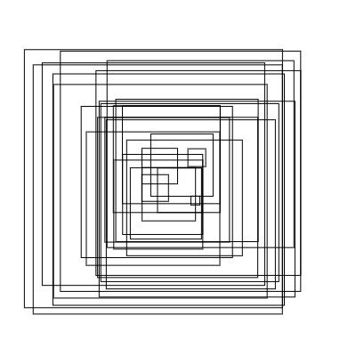
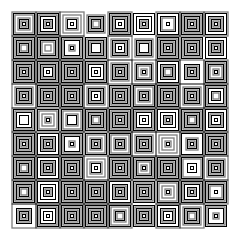
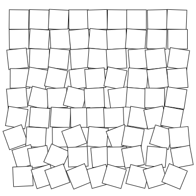
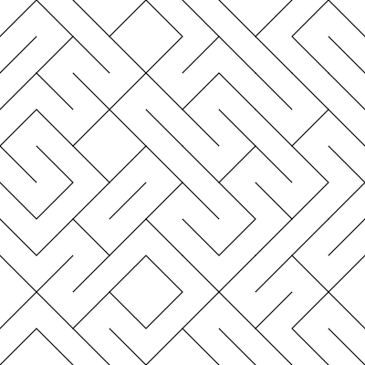
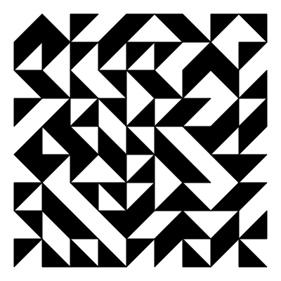
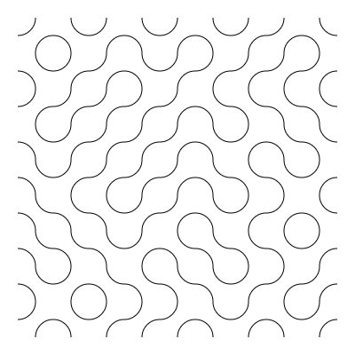
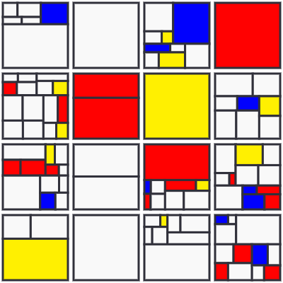
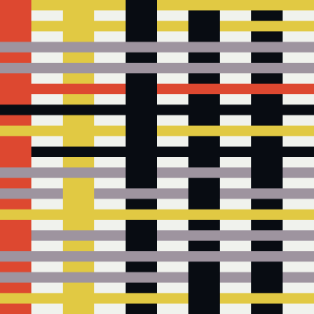

Table of Contents - click to expand!

# P5.JS • Computer Graphics and Art

In this chapter, we take a look at some historical examples of Generative or Algorithm Art. We will recode or rewrite them with p5.js. This selection is inspired, but not limited, by the [ReCode project](http://recodeproject.com/).

All sketches are part of [this online collection](https://editor.p5js.org/hendrikleper/collections/47CP-otxw).

see also:
- https://www.lyceelecorbusier.eu/p5js/?page_id=2861

    
## Vera Molnár
*Untitled 1974 (Squares)*    
[Go to sketch](https://editor.p5js.org/hendrikleper/sketches/1bNTF0jAw)

    
## Vera Molnár
*Des Ordres 1974 (Grid)*    
[Go to sketch](https://editor.p5js.org/hendrikleper/sketches/wdu9Vxb8R)

    
## Georg Nees
*Schotter (Gravel), 1968*    
[Go to sketch](https://editor.p5js.org/hendrikleper/sketches/6iO_W-H2l)

    
## 10PRNT( );
[Go to sketch](https://editor.p5js.org/hendrikleper/sketches/Uhe69Rd5e)

    
## Sébastien Truchet
*Tiling (Triangles)*    
see https://en.wikipedia.org/wiki/Truchet_tiles
[Go to sketch](https://editor.p5js.org/hendrikleper/sketches/ofs6RTC4f9)

    
## Cyril Stanley Smith
*Tiling (Waves)*    
[Go to sketch](https://editor.p5js.org/hendrikleper/sketches/nU7opIjb1)

    
## Piet Mondrian
*Mondrian Grid*    
[Go to sketch](https://editor.p5js.org/hendrikleper/sketches/GSIGWOgph)

    
Anni Albers
*Generative Weave*    
[Go to sketch](https://editor.p5js.org/hendrikleper/sketches/3CClx6ABY)
