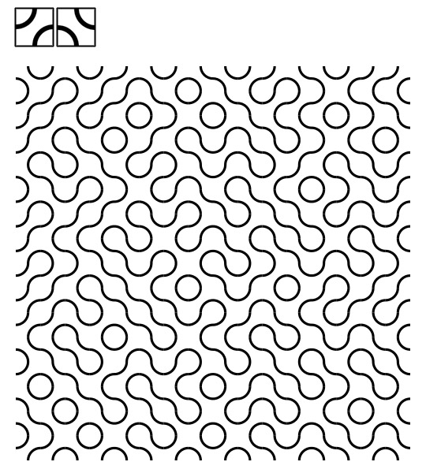

Table of Contents - click to expand!

<!-- TOC depthFrom:2 depthTo:6 withLinks:1 updateOnSave:1 orderedList:0 -->

- [Sol LeWitt](#sol-lewitt)
	- [Wall Drawing 295, 1976](#wall-drawing-295-1976)
- [Jozef Albers](#jozef-albers)
	- [Concentric Squares, 1941](#concentric-squares-1941)
- [Vera Molnár](#vera-molnr)
	- [Untitled, 1974 (Squares)](#untitled-1974-squares)
	- [(Dés)Ordre, 1976 (Grid)](#dsordre-1976-grid)
- [Georg Nees](#georg-nees)
	- [Schotter, 1966 (Gravel)](#schotter-1966-gravel)
- [Truchet tiles](#truchet-tiles)
	- [Contrasting triangles](#contrasting-triangles)
	- [Quarter-circles](#quarter-circles)
	- [Diagonal / 10 PRINT( );](#diagonal-10-print-)
- [Anni Albers](#anni-albers)
	- [Generative Weave](#generative-weave)
- [Piet Mondriaan](#piet-mondriaan)

<!-- /TOC -->

# P5.JS • Generative Art

In this chapter, we take a look at some historical examples of Generative or Algorithm Art. We will recode or rewrite them with p5.js. This selection is inspired, but not limited, by the [ReCode project](http://recodeproject.com/).

All sketches are part of [this online collection](https://editor.p5js.org/hendrikleper/collections/47CP-otxw).

## Sol LeWitt
[Sol LeWitt](https://en.wikipedia.org/wiki/Sol_LeWitt)(1928 - 2007) was one of the most important minimal and conceptual artists. He was one of the founders of the radical, rationally-oriented aesthetic that was deployed as a reaction to the emotionally-oriented American Expressionism of the 1950s and 1960s. In Minimal Art, the form of the artworks is reduced to the extreme. Conceptual Art went one step further by making the concept or underlying idea of an artwork more important than its beauty or physical form.    
Sol LeWitt's wall drawings marked from the late 1960s on, a decisive development in the history of contemporary drawing in particular, and of art in general. Expressing thought processes which the artist conceived beforehand, the wall drawings are then executed directly onto the walls on the scale of the exhibition venue. The wall drawings, produced on-site, exist for the duration of the exhibition; they are then destroyed, giving the work in its physical form an ephemeral quality. Its content (or concept) however remains identical from one exhibition to the next.
### Wall Drawing 295, 1976
Six Superimposed Geometric Figures, white crayon on black wall    
    
:toolbox: [Go to sketch](https://editor.p5js.org/hendrikleper/sketches/wrAGJFof4)

## Jozef Albers
[Jozef Albers](https://en.wikipedia.org/wiki/Josef_Albers) (1888-1976)
and [Anni Albers](https://en.wikipedia.org/wiki/Anni_Albers) (1899-1994) artistic work was strongly influenced by the Bauhaus, where Josef Albers worked and taught as a master builder and from 1930 as deputy director. His later wife Anni Albers first studied at the State Bauhaus in Weimar and later headed the weaving mill. After the National Socialists seized power, the couple emigrated to the USA. Today Josef Albers is regarded as a very influential painter, designer and art teacher, his wife Anni Albers as one of the most important textile artists of all.

### Concentric Squares, 1941
watercolour on screened, brown paper    
    
:toolbox: [Go to sketch](https://editor.p5js.org/hendrikleper/sketches/FyQiCh0dt)

## Vera Molnár
[Vera Molnar](http://veramolnar.com) (born 1924, Hungary) is one of the first women artists to use computers in her practice. Trained as a traditional artist, she studied art history and aesthetics at the Budapest College of Fine Arts and moved to Paris in 1947, where she still lives.    
...

### Untitled, 1974 (Squares)
    
:toolbox: [Go to sketch](https://editor.p5js.org/hendrikleper/sketches/1bNTF0jAw)

### (Dés)Ordre, 1976 (Grid)
    
:toolbox: [Go to sketch](https://editor.p5js.org/hendrikleper/sketches/wdu9Vxb8R)

## Georg Nees
[Georg Nees](http://dada.compart-bremen.de/item/agent/15) (born 1926, Nuremberg) is considered one of the founders of computer art and graphics. He was also one of the first people to exhibit his computer graphics, at the studio gallery of the Technische Hochschule in Stuttgart in February 1965.    
...
### Schotter, 1966 (Gravel)
Schotter is perhaps the most iconic piece by Nees. It shows the delicate balance between order and disorder, and the effects of change.
    
:toolbox: [Go to sketch](https://editor.p5js.org/hendrikleper/sketches/6iO_W-H2l)

## Truchet tiles
Truchet tiles are square tiles decorated with patterns that are not rotationally symmetric. When placed in a square tiling of the plane, they can form varied patterns, and the orientation of each tile can be used to visualize information associated with the tile's position within the tiling.

Truchet tiles were first described in a 1704 memoir by [Sébastien Truchet](https://en.wikipedia.org/wiki/S%C3%A9bastien_Truchet) entitled "Mémoire sur les combinaisons", and were popularized in 1987 by [Cyril Stanley Smith](https://en.wikipedia.org/wiki/Cyril_Stanley_Smith).

### Contrasting triangles
The tile originally studied by Truchet is split along the diagonal into two triangles of contrasting colors.    
    
A tile has four possible orientations.     
Tiling a scheme and with random placement.     
:toolbox: [Go to sketch](https://editor.p5js.org/hendrikleper/sketches/ofs6RTC4f9)

### Quarter-circles
A second common form of the Truchet tiles, due to Smith (1987), decorates each tile with two quarter-circles connecting the midpoints of adjacent sides. Each such tile has two possible orientations.
    
:toolbox: [Go to sketch](https://editor.p5js.org/hendrikleper/sketches/nU7opIjb1)

### Diagonal / 10 PRINT( );
A labyrinth can be generated by tiles in the form of a white square with a black diagonal. Each such tile has two orientations.    
Nick Montfort considers the single line of Commodore 64 BASIC required to generate such patterns [`10 PRINT CHR$(205.5+RND(1)); : GOTO 10`](https://news.mit.edu/2013/10-print-chr2055rnd1-goto-10) - to be "a concrete poem or found poem".

    
:toolbox: [Go to sketch](https://editor.p5js.org/hendrikleper/sketches/Uhe69Rd5e)

## Anni Albers
[Anni Albers](https://en.wikipedia.org/wiki/Anni_Albers) (1899-1994) and Josef Albers (1888-1976) artistic work was strongly influenced by the Bauhaus, where Josef Albers worked and taught as a master builder and from 1930 as deputy director. His later wife Anni Albers first studied at the State Bauhaus in Weimar and later headed the weaving mill. After the National Socialists seized power, the couple emigrated to the USA. Today Josef Albers is regarded as a very influential painter, designer and art teacher, his wife Anni Albers as one of the most important textile artists of all.

### Generative Weave
    
:toolbox: [Go to sketch](https://editor.p5js.org/hendrikleper/sketches/3CClx6ABY)

## Piet Mondriaan
*Mondrian Grid*    
    
:toolbox: [Go to sketch](https://editor.p5js.org/hendrikleper/sketches/GSIGWOgph)

or https://editor.p5js.org/hendrikleper/sketches/vw4GAqJQg

[see also](https://www.lyceelecorbusier.eu/p5js/?page_id=2861)
